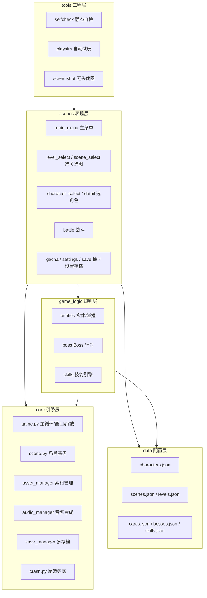

<!--
  发布前检查（本注释不会显示在博客里）：
  ① 全文搜索替换【你的CSDN_ID】为你的实际 CSDN 昵称/ID；
  ② 图片不要靠粘贴：CSDN 会把  当网址去转存而失败。
     正确做法：粘贴全文后，在每个 📌 占位行处用编辑器「插入图片」上传对应 png，
     上传成功后删除该占位行（CSDN 会自动生成它自己图床的 https 链接）。
  ③ 发布时勾选「原创」，版权协议选 CC BY-NC-ND，关闭自由转载；
  ④ 文中所有代码均为教学简化版，复制无法直接运行（防盗用设计）。
-->

# 一个 Python 新手，靠 AI 帮忙把贪吃蛇做成了"蛇娘"游戏（1/5）：我为什么删掉了网格

> 系列：《一个 Python 新手，靠 AI 帮忙把贪吃蛇做成了"蛇娘"游戏》共 5 篇。本篇讲我是怎么起步、以及最后游戏大概长成了什么结构。
> 完整源码不公开；文中代码都是我学习用的简化版，直接复制跑不起来。

先说清楚我的底细：我不是科班出身，Python 也就断断续续学了几个月，写过的最长的程序是课程里的"猜数字"和"打印菱形"。这个游戏从头到尾都是在 AI 的陪伴下一步步摸索出来的——很多时候我连"为什么要这样写"都说不清楚，是 AI 讲给我听、我再照着试，试错了再回头改。

所以这系列文章不敢自称教程，更像是**一个新手的踩坑记录**。如果里面有讲得不严谨、甚至讲错的地方，非常欢迎评论区的大佬指正，我会认真改。

这一篇想聊两件我印象最深的事：**为什么我把最熟悉的"网格"删掉了**，以及**我那堆一开始乱成一团的代码，最后是怎么被 AI 劝着分成几层的**。

> 📌 **此处插入图①**：用编辑器「插入图片」上传 `tools/_shots/battle_story.png`；建议图注：现在游戏跑起来大概是这样——角色能自由跑、镜头会跟着走、周围全是怪。（上传成功后删除本行）

---

## 一、我一开始也想做"网格贪吃蛇"，是后来才发现走不通

老实讲，我最初的想法很朴素：不就是贪吃蛇嘛，网上教程一堆，二维数组 + 方向键，蛇头每帧挪一格，撞墙或者咬到自己就 Game Over。这个版本我确实照着写出来过，也能跑。

但我想做的其实不只是这个。我脑子里的画面是：蛇不再是几格方块，而是一个**会放技能的少女**，在一张比屏幕大得多的地图上自由跑动，被一群怪追着打。等我真往这个方向做的时候，才发现网格处处别扭。下面这三点，是我和 AI 反复讨论后，它帮我梳理出来的（我自己的话可能没这么条理）：

1. **移动不跟手**。网格只能一格一格地跳，我想要的平滑八向移动、那种"贴着手指走"的感觉，网格做不出来；
2. **没有"世界"的概念**。网格蛇基本是单屏固定视角，可我想要一张比屏幕大的地图、镜头跟着角色走，这样才有探索和被追的压迫感；
3. **战斗没地方放**。网格蛇的"吃"就是覆盖判定，而我想做的是普攻、技能、冷却、还有标记/减速/灼烧这些状态——这套东西在网格里根本塞不下。

为了让自己想明白，我当时还列了张表（也是 AI 建议我"把两种方案的差别写出来你就清楚了"）：

| 维度 | 传统网格贪吃蛇 | 我想做的（蛇娘动作生存） |
| --- | --- | --- |
| 移动 | 网格逐格、方向键转向 | 自由移动、八向平滑、镜头跟随 |
| 视角 | 单屏固定 | 大地图（好几倍屏幕）+ 摄像机 |
| 战斗 | 没有 / 吃豆判定 | 普攻 + 5 个主动技能 + 连招 |
| 成长 | 身体变长 | 等级 + 升级选卡 + 角色养成 |
| 内容 | 写死在代码里 | 用 JSON 配置（角色/场景/关卡/卡池/Boss） |

列完这张表我才有底气"删掉网格"。**对我这种新手来说，最大的收获其实不是这个结论，而是"先把需求差别写清楚、再决定技术方案"这个习惯**——以前我总是想到哪写到哪，写一半发现方向错了又推倒重来。

接受"世界是一片连续坐标、屏幕只是一个跟着角色移动的窗口"这个设定之后，后面的东西才慢慢顺起来。当然，"顺起来"只是相对最初而言，中间还是踩了无数坑，那些留到第 2 篇讲。

---

## 二、我的代码本来乱成一团，是 AI 劝我分成五层的

这一节我想诚实地讲一段"黑历史"。

我最开始写的时候，所有东西都堆在一个文件里：画图的、算碰撞的、读存档的、响应按键的，全挤在一起，很快就到了两千多行。结果就是——改一个地方，另一个地方莫名其妙就坏了；我想加个新角色，翻遍代码都不知道该动哪里。

我把这个窘境描述给 AI，它没有直接帮我重构，而是先给我讲了一个我当时完全没听过的原则，大意是：**"管规则的代码不要去碰画面，管画面的代码不要去碰数值"**。它建议我把项目拆成几层，每层只干自己的事。我半信半疑地照着拆了一遍，虽然过程很痛苦（要搬的代码太多了），但拆完之后，"加角色只改配置、调数值只改一个文件"这种事就真的变得轻松了。

下面是我现在的分层结构（这张图也是 AI 帮我画的，我自己一开始根本画不出来）：

<!-- 配图②：mermaid 架构图（CSDN Markdown 支持 mermaid；若不渲染可截图替换） -->


用我自己的大白话解释一下这五层（专业说法我怕讲错，就讲我怎么理解的）：

- **core 引擎层**：负责"游戏能跑起来"这件事——主循环、窗口、缩放、素材、音频、存档。它压根不知道"蛇"是什么，只提供能力；
- **game_logic 规则层**：负责"游戏怎么玩"——实体、碰撞、Boss、技能。这层我刻意不让它 import 画图的代码，它只算出"发生了什么"，比如"某个怪被标记了"；
- **scenes 表现层**：负责"游戏长什么样"——每个界面一个文件，把规则层算出来的结果画到屏幕上，再把我的按键翻译成规则层能懂的调用；
- **data 配置层**：所有数值和内容都放在 JSON 里，改内容不用改代码；
- **tools 工程层**：几个小工具，帮我检查代码有没有低级错误、自动试玩、无头截图（后面会提到）。

说实话，刚拆完的时候我并没有完全体会到这里面的好处，是后来一次次"加角色居然真的不用碰战斗代码"之后，才慢慢信服 AI 当初的建议。**这大概就是我这种新手学架构的方式：先照做，再在实践中反过味来。**

---

## 三、九个界面，我却只写了一个主循环

游戏现在有九个界面（主菜单、选关、选图、选角色、角色详情、战斗、抽卡、设置、存档管理）。要按我最初的写法，估计得写九个 while 循环，然后乱成一锅粥。

又是 AI 提醒我：**主循环应该只有一个，界面之间靠"切换场景"来跳转**。它给我讲了一个叫"场景管理器"的模式，我照着实现后，入口代码薄得让我自己都有点意外：

```python
# 教学简化版·非完整可运行·by 【你的CSDN_ID】
game = Game()

game.register_scene("main_menu",        MainMenuScene)        # 主菜单
game.register_scene("level_select",     LevelSelectScene)     # 剧情选关
game.register_scene("scene_select",     SceneSelectScene)     # 无尽选图
game.register_scene("character_select", CharacterSelectScene) # 选角色
game.register_scene("character_detail", CharacterDetailScene) # 角色详情
game.register_scene("battle",           BattleScene)          # 战斗
# …抽卡 / 设置 / 存档同理

game.change_scene("main_menu")  # 切到起始界面
game.run()                      # 主循环：处理输入 → 更新逻辑 → 画出来
```

`register_scene` 就是"告诉引擎有这么个界面、它的名字叫什么"，`change_scene` 就是"跳到某个名字的界面"。所有界面都继承同一个基类 `Scene`，它规定了一个界面"该会做的几个动作"：

```python
# 教学简化版·非完整可运行·by 【你的CSDN_ID】
class Scene(ABC):
    def __init__(self, game):
        self.game = game

    @property
    def screen(self):          # 当前该画到哪张"画布"上
        return self.game.render_surface

    @property
    def S(self):               # 缩放比例（1.0 = 我设计时的基准分辨率）
        return self.game.scale

    def s(self, value):        # 设计尺寸 → 实际像素，字体/按钮/间距都过一下它
        return int(value * self.S)

    def on_resize(self):       # 窗口大小变了怎么办：默认重建一遍布局
        self.enter()

    @abstractmethod
    def enter(self): ...                  # 进入界面：准备字体/按钮/布局
    @abstractmethod
    def handle_events(self, events): ...  # 处理输入（点鼠标、按键）
    @abstractmethod
    def update(self, dt): ...             # 更新逻辑
    @abstractmethod
    def draw(self): ...                   # 画出来
```

这里面有两个坑，是我自己撞了之后 AI 才帮我讲明白的，记下来给同样是新手的朋友提个醒：

- **`screen` 我一开始写成了"进入界面时存一份"**，结果一切全屏、一拖窗口，画面就黑边或者错位。后来才知道要写成"每次用的时候现取当前画布"（也就是上面的 `@property`），这样窗口怎么变都不会画到旧尺寸上去；
- **切场景的时机**。我最初在"处理鼠标点击"的循环里直接就把当前场景换掉了，结果程序当场崩给我看——因为它正拿着这个场景对象在用，我却把它抽走了。AI 让我改成"先做个标记，等这一帧忙完再统一切"，问题就没了。

这两个坑单看都很小，但对当时的我来说，每一个都卡了我一晚上。

---

## 四、加一个角色，居然只用改一份 JSON

前面反复提到"改内容不用改代码"，这一节具体说说它长什么样。

在我的项目里，一个角色不是写死在代码里的一个类，而是一份 JSON 配置。比如初始角色"樱落"大概是这样（我截了一小段）：

```json
{
  "id": "sakura",
  "name": "樱落",
  "rarity": "SSR",
  "element": "樱",
  "kit": {
    "actives": [
      {"id": "petal_slash", "type": "petal_slash", "name": "落樱·绯斩", "key": 1},
      {"id": "sakura_mark", "type": "mark",  "name": "花印",     "key": 2},
      {"id": "sakura_pull", "type": "pull",  "name": "落樱引",   "key": 3},
      {"id": "sakura_burst","type": "burst", "name": "绯爆",     "key": 4},
      {"id": "sakura_rally","type": "rally", "name": "樱舞鼓舞", "key": 5}
    ],
    "passive": {"id": "p_bloom_guard", "name": "花守"}
  },
  "head":     "characters/sakura/head.png",
  "full":     "characters/sakura/full.png",
  "body_seg": "characters/sakura/body_seg.png",
  "tail_tip": "characters/sakura/tail_tip.png"
}
```

我最开始看不懂 `type` 这个字段是干嘛的，AI 解释后我才明白：它指向技能引擎里的一种"行为类型"（比如 mark 是标记、pull 是把怪拉到一起、burst 是引爆）。**六个角色其实共用同一套技能机制，只是配色、名字、大招不一样**——这就是所谓的"机制复用、外观各异"，全靠这份配置在驱动。

所以后来我加新角色时，真的一行战斗代码都没改，只是加了这么一份 JSON、再配上四张素材图。第一次成功的时候我还挺激动的，专门截图存了下来。

场景、关卡、升级卡、Boss 也都是 JSON。对"策划和程序都是我一个人"的情况来说，这种解耦太友好了：我想调数值就改 JSON，不用担心手滑把引擎代码改坏。

> 📌 **此处插入图③**：用编辑器「插入图片」上传 `tools/_shots/character_select.png`；建议图注：角色选择界面——六个蛇娘全是靠 JSON 配出来的。（上传成功后删除本行）

---

## 五、项目目录长这样

最后贴一下我的目录结构，给同样在摸索项目怎么组织的朋友一个参考（我也是被 AI 一路"纠正"成这样的，一开始可比这乱多了）：

```text
贪吃蛇娘化版/
├── core/          # 引擎：主循环/场景基类/素材/音频/存档/崩溃兜底
├── game_logic/    # 规则：实体/Boss/技能引擎（不碰画面）
├── scenes/        # 表现：主菜单/选关/选角色/战斗/抽卡/设置…
├── ui/            # 通用小控件：按钮/滑块
├── data/          # 配置：characters/scenes/levels/cards/bosses/skills.json
├── assets/        # 素材：背景/角色/道具/音效
├── tools/         # 工程小工具：自检/自动试玩/无头截图/素材处理
├── settings.py    # 全局数值/分辨率/连招常量（我唯一的调参入口）
└── main.py        # 入口：注册场景 + 启动主循环
```

这里想单独夸一句 `settings.py`：**我所有的平衡数值、分辨率选项、连招常量都塞在这一个文件里**，调参只改它就行。这个习惯也是 AI 帮我养成的——以前我把数值散落各处，调个平衡要翻好几个文件，改到怀疑人生。第 3 篇讲平衡的时候，你会看到这份文件帮了我多大忙。

---

## 下一篇

架构勉强搭起来了，但"能跑"离"好玩"还差得远。光是"画面糊不糊、操作跟不跟手"，就够我这个新手喝一壶的。

第 2 篇我想讲讲自己踩过的一个特别蠢的坑——**每切一次全屏，窗口就莫名其妙小一圈**，还有大地图的镜头到底怎么才能让操作跟手。如果你也在用 pygame 做游戏，希望我的坑能帮你少走点弯路。

> 📌 **此处插入图④**：用编辑器「插入图片」上传 `tools/_shots/main_menu.png`；建议图注：游戏主菜单。（上传成功后删除本行）

---

© 2026 【你的CSDN_ID】 · 本文原创，CC BY-NC-ND（署名-非商业-禁止演绎）
我是一个还在学习的 Python 新手，文中若有错漏欢迎指正。完整源码不公开；文中代码为学习用简化版，直接复制无法运行。
系列目录：（1/5）起步与架构 ·（2/5）渲染与手感 ·（3/5）战斗与平衡 ·（4/5）内容管线 ·（5/5）工程与发布
