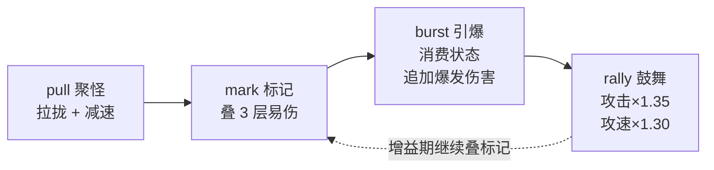

<!--
  发布前检查（本注释不会显示在博客里）：
  ① 全文搜索替换【你的CSDN_ID】为你的实际 CSDN 昵称/ID；
  ② 图片不要靠粘贴：CSDN 会把  当网址去转存而失败。
     正确做法：粘贴全文后，在每个 📌 占位行处用编辑器「插入图片」上传对应 png，
     上传成功后删除该占位行（CSDN 会自动生成它自己图床的 https 链接）。
  ③ 发布时勾选「原创」，版权协议选 CC BY-NC-ND，关闭自由转载；
  ④ 文中所有代码均为教学简化版，复制无法直接运行（防盗用设计）。
-->

# 一个 Python 新手，靠 AI 帮忙把贪吃蛇做成了"蛇娘"游戏（3/5）：五个技能怎么串成连招

> 系列：《一个 Python 新手，靠 AI 帮忙把贪吃蛇做成了"蛇娘"游戏》共 5 篇。本篇讲战斗系统：连招、升级卡池，以及我怎么逼自己"别挂机"。
> 完整源码不公开；文中代码都是我学习用的简化版，直接复制跑不起来。

前两篇把"能跑、清晰、跟手"解决了，但说实话，那只是个"能动的画面"，离"好玩"还差得远。真正让我熬最多夜、也最有成就感的，是这一篇要讲的**战斗系统**。

先自曝两个黑历史：一是我最初做的五个技能**各放各的、毫无配合**，打架就是无脑乱按；二是我的第一版里，怪物傻站着不动，我可以**原地挂机刷上半天**，一点压力都没有（这个糗事后面细讲）。这两件事都是在 AI 的反复"敲打"下才慢慢改好的。

> 📌 **此处插入图①**：用编辑器「插入图片」上传 `tools/_shots/character_detail_skills.png`；建议图注：角色详情里的技能页——每个技能都配了说明，我自己都能看懂了。（上传成功后删除本行）

---

## 一、我一开始的技能"各放各的"，一点配合都没有

我最初的想法很直白：给角色五个技能，绑到 1~5 键，各算各的冷却，玩家想按哪个按哪个。做出来一看——能放，特效也有，但**特别没意思**：五个技能像是五个陌生人，凑在一起各干各的，打起来就是"哪个亮了点哪个"。

我把这个困惑说给 AI，它给了我一个当时听不太懂、但后来受益匪浅的建议：**"让技能之间能传递状态，前一个技能为后一个技能做铺垫，它们就串成'连招'了。"**

它举了个例子：如果一个技能能先给敌人"做个标记"，另一个技能"引爆标记"时伤害更高，那玩家就会自然地想"先标记、再引爆"，而不是乱按。我一下子就被点通了——**连招的本质，是让技能之间产生依赖关系。**

---

## 二、连招链：标记 → 聚怪 → 引爆 → 鼓舞

顺着这个思路，我和 AI 一起设计了一条连招链。六个角色都共用这套机制，只是键 1 的专属大招和配色命名不同：

| 键 | 组件 | 类型(type) | 作用 | 冷却 |
| --- | --- | --- | --- | --- |
| 1 | 专属大招 | 各角色不同 | 樱落是"落樱·绯斩"，其余角色各异 | 各不相同 |
| 2 | 标记 | `mark` | 给范围内的怪叠"易伤"，最多 3 层 | 7s |
| 3 | 聚怪 | `pull` | 把周围的怪拉到一起并减速 | 9s |
| 4 | 引爆 | `burst` | 消费标记/状态，打出成吨追加伤害 | 10s |
| 5 | 鼓舞 | `rally` | 短时间内攻击、攻速大涨 | 14s |

连起来打就是：**先聚怪（把散的怪拢成一堆）→ 标记（叠满 3 层易伤）→ 引爆（一次性炸出最高伤害）→ 鼓舞（趁着增益继续输出）**。我用 mermaid 画了这条链，也是我自己理解连招的方式：



设计出来我自己试了一把，那种"一套连招打下去怪群瞬间蒸发"的爽感，是之前乱按技能完全没有的。

---

## 三、规则层只"发事件"，战斗场景负责"落地"

这里要回到第一篇讲过的分层纪律——**规则层不碰画面**。技能系统就是这条纪律的典型例子，也是我一开始最容易写乱的地方。

我最初是把"放技能"和"画特效"揉在一起写的：技能函数里既算伤害、又 `pygame.draw` 画圈，结果一个技能函数几十行，六个技能就是六坨，改一个动全身。AI 看不下去了，让我把它拆开：**技能引擎只负责"我释放了一个什么效果"，至于这个效果长什么样、怎么结算，交给战斗场景去做。**

具体做法是：技能释放时不画图，而是**返回一个"事件字典"**，描述"发生了什么"：

```python
# 教学简化版·非完整可运行·by 【你的CSDN_ID】
def cast(self, pos, key=1, cdr=0.0):
    a = self._active_by_key(key)              # 找到绑在这个键上的技能
    if not a or not self.ready(a["id"], cdr):
        return None                            # 没这个键 / 还在冷却 → 放不出来
    ev = self._build_event(a["type"], pos)     # 造一个"事件字典"（关键）
    self.cds[a["id"]] = self.cooldown_max(a["id"], cdr)   # 进入冷却
    return ev                                  # 把事件交给战斗场景去表现

def _build_event(self, stype, pos):
    """只描述"发生了什么"，完全不画图、不碰像素。"""
    if stype == "mark":        # 标记：给范围内的怪叠易伤
        return {"type": "mark", "radius": S.COMBO_MARK_RADIUS,
                "dmg": S.COMBO_MARK_DMG, "amp": S.COMBO_MARK_AMP,
                "time": S.COMBO_MARK_TIME, "max_stacks": S.COMBO_MARK_MAX_STACKS}
    if stype == "burst":       # 引爆：消费标记/状态，按层数追加伤害
        return {"type": "burst", "radius": S.COMBO_BURST_RADIUS,
                "dmg": S.COMBO_BURST_DMG, "per_stack": S.COMBO_BURST_PER_STACK,
                "status_bonus": S.COMBO_BURST_STATUS_BONUS,
                "time_bonus": S.COMBO_BURST_TIME_BONUS}
    # …pull 聚怪 / rally 鼓舞 同理…
    return None
```

你看，`_build_event` 返回的就是一堆"数据"——半径多大、伤害多少、能叠几层，**没有一行画图代码**。战斗场景拿到这个字典后，才去决定"画个什么颜色的圈、扣多少血、加几层标记"。

这么一拆，好处我后来才慢慢体会到：**技能引擎可以单独测试（不用开窗口），特效想怎么改都不影响数值。** 对新手来说，"把'算什么'和'画什么'分开"这条经验，我觉得比任何具体技巧都值钱。

---

## 四、连招的灵魂：标记能叠层，引爆会"看菜下饭"

如果只是"标记一下、引爆一下"，那连招和随便放两个技能也没区别。真正让它有深度的，是 AI 帮我加的两个机制：

**① 标记可以叠层。** 同一个怪被标记多次，易伤会叠加（最多 3 层，每层受伤 +28%，叠满就是 +84%）。这就鼓励玩家"对着精英怪多标几次再引爆"。

**② 引爆会"看菜下饭"。** 引爆的伤害不是固定的，而是**根据目标身上的状态越多、标记层数越高、标记越新鲜，伤害越高**。这个公式是我和 AI 一起调出来的：

```text
引爆伤害 = 基础伤害 × (1
                      + 命中状态数 × 50%      # 标记/减速/灼烧，每个都算
                      + 标记层数   × 30%      # 叠满 3 层就是 +90%
                      + 标记剩余时间比 × 25%   # 越早引爆（标记越新鲜）加成越高
                     )
```

所有这些数值，我都**集中放在 `settings.py` 一个地方**，调平衡时只改这一个文件就行（这也是第一篇夸过的那个习惯，第 3 篇真的救了我）：

```python
# 教学简化版·非完整可运行·by 【你的CSDN_ID】
# —— 连招数值全集中在 settings.py，调平衡只改这里 ——
COMBO_MARK_MAX_STACKS = 3       # 标记最多叠 3 层
COMBO_MARK_AMP        = 0.28    # 每层标记 → 受伤 +28%（叠满 +84%）
COMBO_MARK_TIME       = 6.0     # 标记持续 6 秒

COMBO_BURST_PER_STACK    = 0.30 # 引爆：每层标记额外 +30% 伤害
COMBO_BURST_STATUS_BONUS = 0.50 # 引爆：每命中一个状态额外 +50%
COMBO_BURST_TIME_BONUS   = 0.25 # 引爆：按标记剩余时间最多再 +25%

COMBO_RALLY_ATK    = 1.35       # 鼓舞：攻击 ×1.35
COMBO_RALLY_ATKSPD = 1.30       # 鼓舞：攻速 ×1.30，持续 6 秒
```

坦白讲，我一开始的引爆就是"固定 55 伤害"，标记完引爆和直接引爆没区别，连招形同虚设。是 AI 提醒我："**如果连招的每一步都不能让下一步更强，那玩家为什么要按顺序放？**" 这句话我记到现在。

---

## 五、肉鸽卡池：每次升级三选一

动作游戏光有操作还不够，还得有"这一局和上一局不一样"的变化感。我参考了肉鸽游戏的做法：**每次升级，弹出三张卡让我三选一。**

卡牌不写死在代码里，还是一份 JSON（延续数据驱动的老规矩）。我截几张：

```json
{ "id": "p_atk",      "stat": "atk",      "name": "锋锐之牙", "desc": "攻击力 +14%" },
{ "id": "p_cdr",      "stat": "cdr",      "name": "时之砂漏", "desc": "技能冷却缩减 +10%" },
{ "id": "p_skilldmg", "stat": "skilldmg", "name": "秘法共鸣", "desc": "技能伤害 +15%（大招与连招）" },
{ "id": "p_range",    "stat": "range",    "name": "鹰眼",     "desc": "普攻索敌范围 +15%" }
```

每张卡有个 `stat` 字段，对应战斗里的一个属性；选了就往那个属性上加一点。这样不同的选择会滚出不同的"流派"——比如堆冷却缩减走"技能连招流"，堆攻击和暴击走"暴力输出流"。

这里也有个成长过程：**我一开始只做了 6 张卡**，选来选去就那几张，两三局就腻了。后来硬着头皮扩到 **12 张**（加了经验获取、伤害减免、闪避冷却、生命再生、技能伤害、索敌范围等），build 的多样性一下子就上来了。虽然加卡的时候接线接到眼花（每张卡都要在战斗逻辑里找到对应的生效点），但结果是值得的。

> 📌 **此处插入图②**：用编辑器「插入图片」上传 `tools/_shots/battle_cards.png`；建议图注：升级时的"三选一"——每次弹三张卡，选哪张决定这一局的流派。（上传成功后删除本行）

---

## 六、我怎么逼自己"别挂机"：难度曲线 + 自动试玩

现在讲开头那个糗事。

我的第一版有个致命问题：**怪刷出来就慢悠悠地飘，打死一批又刷一批，节奏恒定。** 结果我发现，只要站桩无脑放技能，就能一直刷下去，甚至能挂机刷半天——这游戏等于没有挑战。

我把这个问题丢给 AI，它帮我梳理出三个"让游戏有压力"的方向，我一个个实现：

1. **时间压力**：游戏进行越久，一个隐藏的"压力系数"越高，怪的整体强度随之上升；
2. **怪会越来越快、越来越硬**：移动速度和血量都随存活时间增长，站桩迟早扛不住；
3. **刷怪越来越密，而且只在你视野外刷**：怪不会在你眼前凭空冒出来（那样很出戏），而是在摄像机视野外一圈生成，再朝你压过来。

这三条加起来，就形成了"你越强、怪也越强，逼着你不断移动和决策"的节奏，再也没法无脑挂机了。

但这里有个更大的问题：**我怎么知道难度调得合不合适？** 我一开始的办法是"自己玩两把，凭感觉"。AI 直接否定了："**你一个人玩几把，样本太小，而且你会越玩越熟，感觉根本不准。**" 它建议我写一个"自动试玩探针"——一个能自己走位、自己放技能、自己选卡的机器人，让它连续打很多局，把数据统计出来。

我照着写了个 `playsim.py`，它每次跑完会输出这样一张表（下面是我**真实跑出来**的一次结果）：

```text
================================================================
 自动试玩 · 平衡性检查（专属技能包 + 剧情/无尽）
================================================================
第1局[剧情]  存活 805.4s  等级 40  击杀 1980  得分 402086  受伤  1  结局 阵亡
第2局[无尽]  存活 142.8s  等级 17  击杀 155  得分  16844  受伤  3  结局 阵亡
第3局[无尽]  存活 139.3s  等级 16  击杀 134  得分  15681  受伤  5  结局 阵亡
----------------------------------------------------------------
平均存活 362.5s   平均等级 24.3   平均击杀 756   通关 0/3
```

有了这张表，我调平衡就有依据了：剧情模式能撑到 805 秒、40 级、近 2000 击杀，说明成长曲线是通的；无尽模式 140 秒左右阵亡，说明后期压力确实上来了。

不过 AI 也提醒我一句很重要的话，避免我误读数据：**"单局的数字别太当真，探针也有运气成分（刷什么怪、选什么卡都是随机的），要看多局的平均和趋势。"** 而且探针是"理想操作"，真人玩起来只会更难。这个"看趋势不看单点"的思路，我觉得放到很多地方都适用。

> 📌 **此处插入图③**：用编辑器「插入图片」上传 `tools/_shots/battle_endless.png`；建议图注：无尽模式后期——怪越来越多、越来越硬，逼着你不停移动。（上传成功后删除本行）

---

## 下一篇

到这里，游戏"好玩"的部分基本成型了：有连招、有 build、有压力曲线。但支撑这一切的**内容**——角色立绘、场景背景、还有全程的音乐音效——是怎么来的？

第 4 篇是我最想写的一篇，因为里面有件我自己都觉得神奇的事：**这个游戏没有一首 BGM 是现成的音频文件，全部音乐和音效都是我用 Python 现场"算"出来的**（对，用代码作曲，我一开始也不信）。另外还会讲我怎么用 AI 生成美术、再用一个脚本把它们自动切成游戏能用的素材。

如果你也在做独立小游戏、又卡在"没有美术和音乐资源"上，第 4 篇应该对你有点用。我菜，但知无不言，欢迎评论区交流。

---

© 2026 【你的CSDN_ID】 · 本文原创，CC BY-NC-ND（署名-非商业-禁止演绎）
我是一个还在学习的 Python 新手，文中若有错漏欢迎指正。完整源码不公开；文中代码为学习用简化版，直接复制无法运行。
系列目录：（1/5）起步与架构 ·（2/5）渲染与手感 ·（3/5）战斗与平衡 ·（4/5）内容管线 ·（5/5）工程与发布
